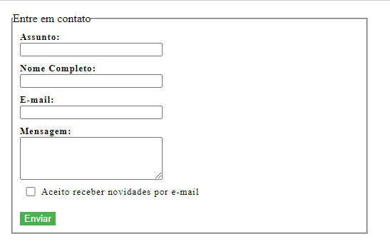

# Formulario de contato

# 📃 Projeto

Formurario de contato que armazena e retorna as informações escritas pelo usuario

<ul>
  <li>Formulario</li>
  <li>DOM (Document Object Model): Localiza e retorna o conteudo HTML</li>
</ul>

 

# 🧪 Tecnologias

<ul>
  <li>HTML</li>
  <li>CSS</li>
  <li>JavaScript</li>
</ul>
