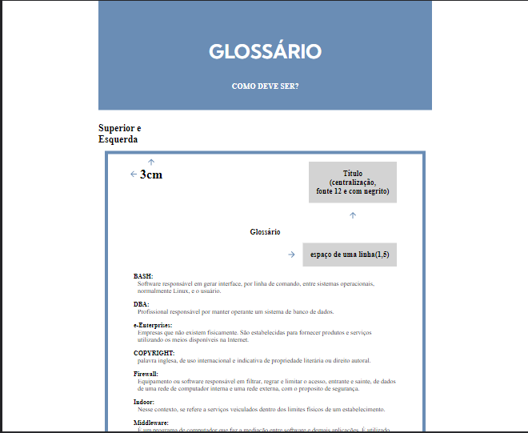
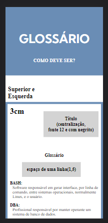

# 📃 Projeto

Aplicação simples que mostra como deve ser a formatação de um glossario para TCC

<ul>
  <li>Responsiva baseada no modelo Desktop-First</li>
  <li>Layout feito com FlexBox e position relative</li>
</ul>

 

# 🧪 Tecnologias

<ul>
  <li>HTML</li>
  <li>CSS</li>
</ul>

## Versão desktop

 

## Versão mobile

